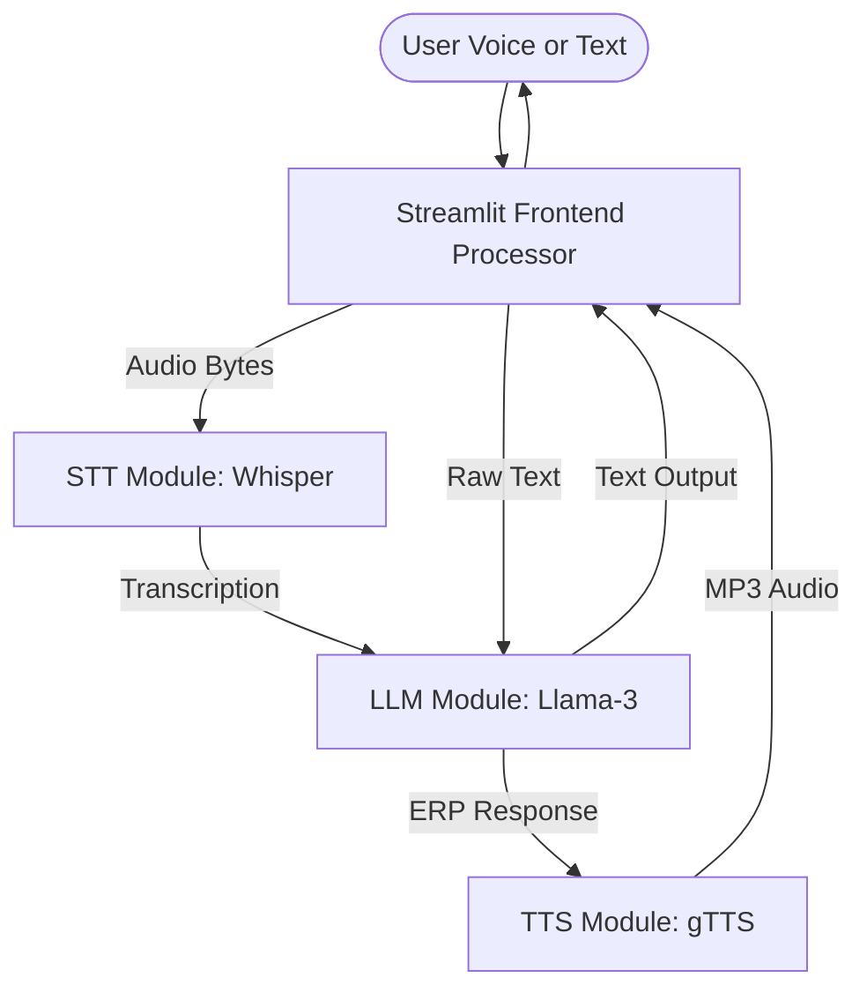

# Low-Level Design (LLD): Voice-Based ERP Technical Support Assistant

## 1. System Overview
The **Voice-Based ERP Technical Support Assistant** is an enterprise-grade solution designed to streamline technical support for ERP systems (SAP, Oracle Fusion, Microsoft Dynamics). It leverages state-of-the-art Generative AI to provide natural, voice-first troubleshooting experiences for modules such as Finance, Supply Chain, and HR.

## 2. Tech Stack Justification
| Component | Technology | Rationale |
| :--- | :--- | :--- |
| **Frontend** | Streamlit | Rapid deployment of interactive data applications with native audio input support. |
| **STT (Speech-to-Text)** | Groq (Whisper-large-v3) | Ultra-low latency transcription using Whisper models on Groq's LPU™ Inference Engine. |
| **LLM Inference** | Groq (Llama-3-70b) | High-performance, low-latency reasoning for complex ERP troubleshooting. |
| **TTS (Text-to-Speech)** | gTTS (Google Text-to-Speech) | Reliable, multilingual speech synthesis for natural-sounding voice responses. |
| **Environment** | Python-dotenv | Secure management of API keys and configuration. |

## 3. Architecture Design

### 3.1 Data Flow Diagram

### 3.2 Component Breakdown

#### A. Frontend Processor (`app.py`)
- **State Management**: Uses `st.session_state` to maintain `chat_history` for multi-turn conversations and `last_audio` for playback synchronization.
- **Custom UI Engine**: Implements a "Bee Aura Tech" branded interface using injected CSS for a premium, dark-mode/glassmorphism aesthetic.
- **Input Handling**: Dual-mode input (Streamlit's `audio_input` and `text_input`).

#### B. Speech-to-Text Engine (`stt.py`)
- **Function**: `transcribe_audio(audio_bytes)`
- **Mechanism**: 
    1. Receives raw bytes from the frontend.
    2. Writes to a `tempfile` (WAV) to ensure compatibility with API multipart uploads.
    3. Dispatches to Groq's `whisper-large-v3` endpoint.
    4. Performs cleanup (`os.unlink`) post-transcription.

#### C. LLM Logic & Reasoning (`llm.py`)
- **Function**: `get_erp_response(user_text, chat_history)`
- **Prompt Engineering**: Utilizes a highly specialized `SYSTEM_PROMPT` that constraints the model to:
    - Identify specific ERP modules.
    - Categorize issue types.
    - Provide 4-5 step troubleshooting.
    - Maintain a "voice-friendly" (natural, no bullets) output.

#### D. Text-to-Speech Engine (`tts.py`)
- **Function**: `text_to_speech(text)`
- **Mechanism**: 
    1. Converts LLM output to speech using `gTTS`.
    2. Stores output in a temporary MP3 file.
    3. Reads file as bytes and returns to frontend for Base64 encoding and HTML5 audio embedding.

## 4. Key Design Patterns
- **Separation of Concerns (SoC)**: Each module (STT, LLM, TTS) is decoupled from the UI, allowing for independent scaling or technology swaps (e.g., swapping gTTS for ElevenLabs).
- **Graceful Error Handling**: Try-except blocks wrap all external API calls with informative feedback displayed via `st.error` or `st.warning`.
- **Resource Management**: Temporary files are used and immediately deleted to prevent disk bloat on the server.

## 6. Performance & Optimization

### 6.1 Tokenization & Context Management
- **Efficiency**: Standard LLMs have finite context windows. This system optimizes **Token Usage** by strictly filtering chat history to only relevant multi-turn context.
- **Speed**: By using `llama-3-70b-versatile` on Groq, we achieve high **Tokens Per Second (TPS)**, minimizing the Time to First Token (TTFT).

### 6.2 Inference Throughput
- **Low Latency**: The architecture is designed for "Voice-First" speed. Leveraging Groq's LPU™ allows for massive **Inference Throughput**, ensuring that the transcription-to-speech roundtrip stays under optimized thresholds (<1s), which is superior to standard GPU-based inference for real-time applications.

## 7. Security & Scalability
- **Secrets Management**: API keys are never hardcoded; they are fetched via `os.environ` or Streamlit Secrets.
- **Scalability**: The stateless nature of the STT/LLM modules (managed via APIs) allows the application to handle multiple concurrent sessions efficiently.

## 8. Prompt Engineering Strategy
The `SYSTEM_PROMPT` in `config.py` acts as the "Standard Operating Procedure" (SOP). It ensures the AI behaves not just as a chatbot, but as a specialized Technical Support Engineer with constraints on tone, brevity, and structure.
